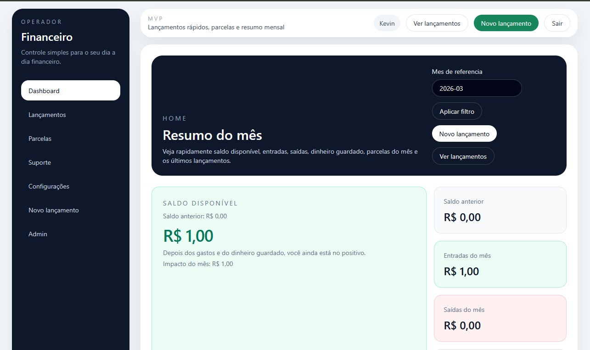
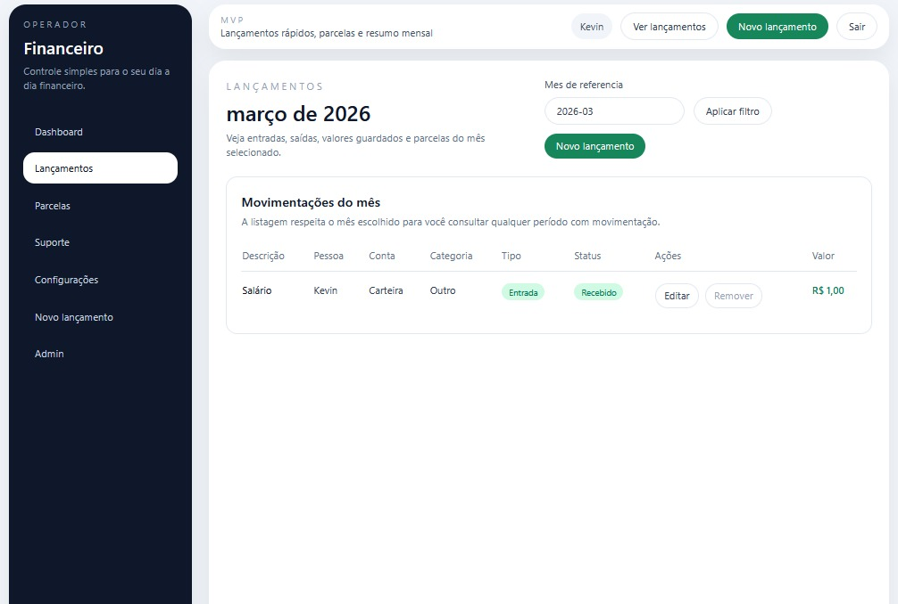
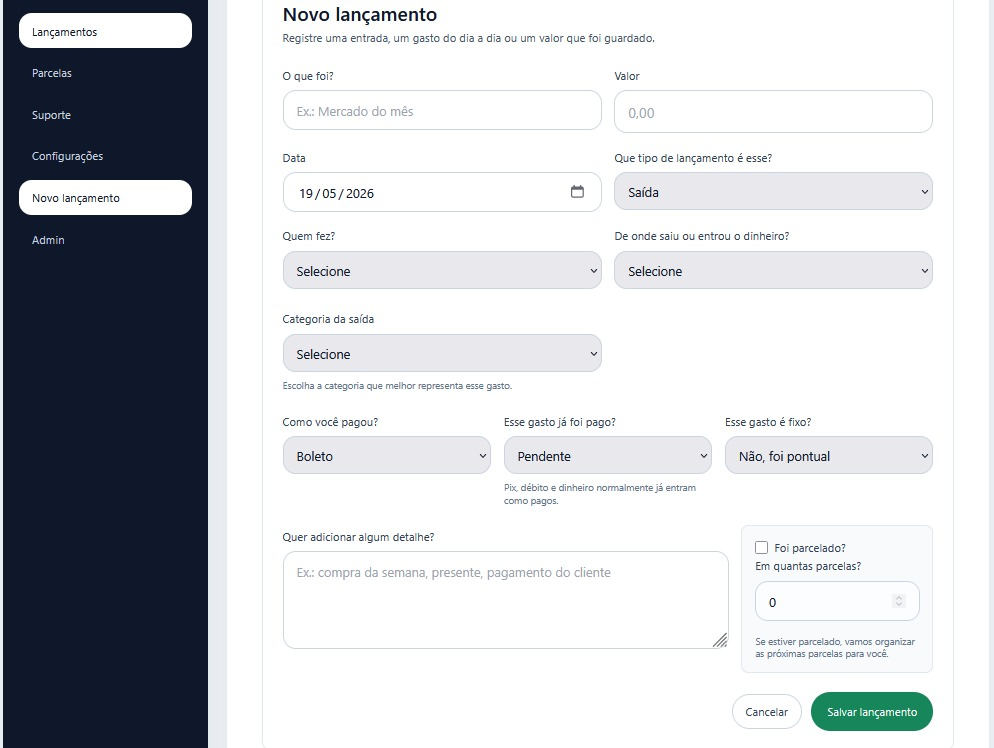
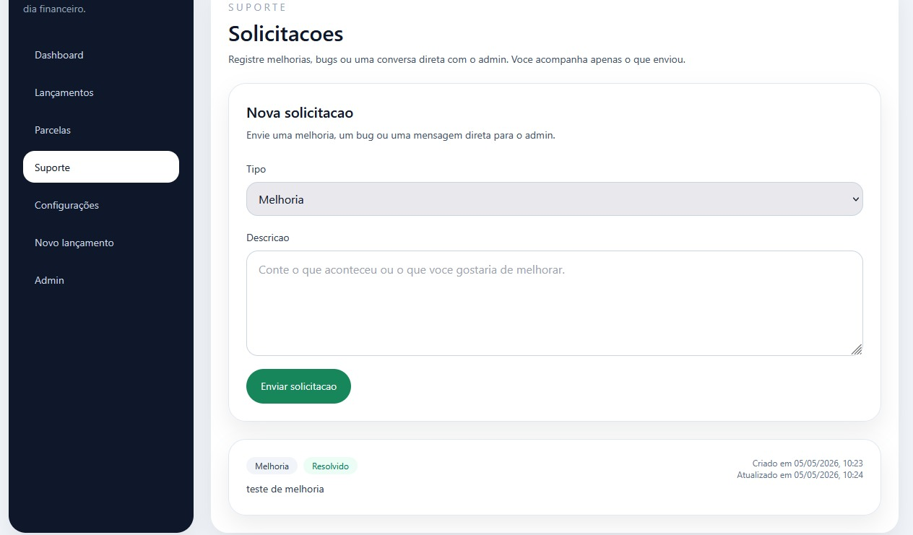
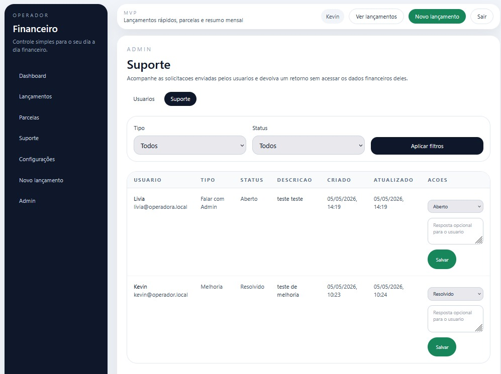
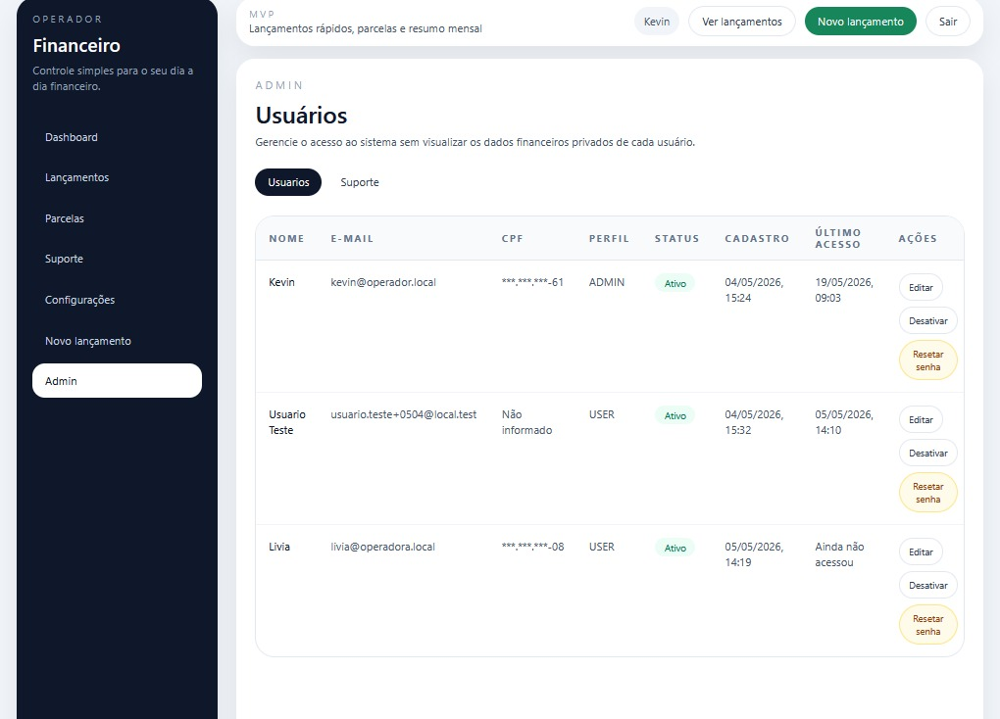
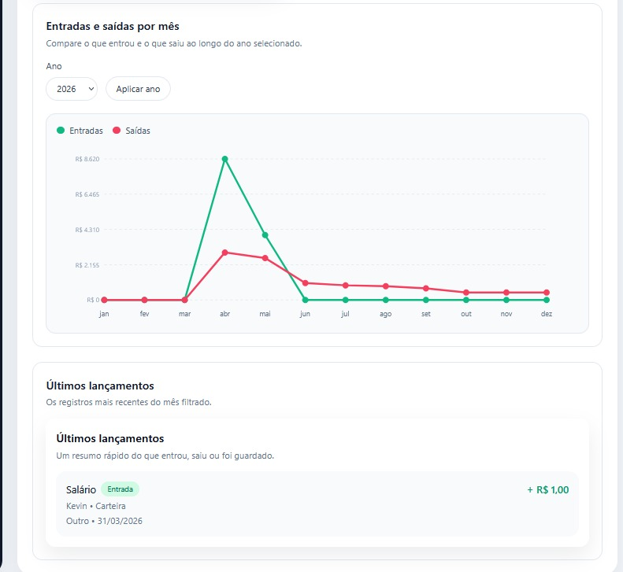

<div align="center">

# Operador Financeiro

Sistema web de controle financeiro desenvolvido para gerenciamento de entradas, saídas, parcelas, reservas e organização financeira, com foco em segurança, privacidade e experiência do usuário.

</div>

---

## 📊 Dashboard

O dashboard apresenta um resumo financeiro completo do mês, incluindo saldo disponível, entradas, saídas, dinheiro guardado, ranking de gastos e acompanhamento de parcelas.



<br />

<p align="center">
  
</p>

---

## 💸 Lançamentos

A área de lançamentos permite registrar entradas, saídas, gastos fixos, compras parceladas e movimentações financeiras diversas, com controle por categoria, conta, status e pessoa responsável.

| Listagem de lançamentos | Novo lançamento |
| --- | --- |
|  |  |

---

## 🧾 Parcelas

Acompanhe compras parceladas, compromissos do mês, valores pagos e pendentes, com filtros por período e status.


---

## 🆘 Suporte

A área de suporte permite registrar melhorias, bugs ou solicitações diretamente ao administrador, mantendo histórico, status e comunicação organizada.

| Suporte do usuário | Suporte administrativo |
| --- | --- |
|  |  |

---

## 🛡️ Administração

O painel administrativo permite gerenciar usuários ativos, redefinir senhas, controlar acessos e acompanhar solicitações sem expor dados financeiros privados.



---

## ⚙️ Configurações

A área de configurações permite personalizar categorias, contas, cartões e formas de pagamento utilizadas no sistema.

Ela foi pensada para centralizar a base de organização financeira do usuário, mantendo o cadastro das estruturas que alimentam lançamentos, filtros e relatórios do sistema.

---

## 📈 Indicadores e gráficos

O sistema possui indicadores financeiros e gráficos comparativos para acompanhamento de entradas, saídas e comportamento financeiro ao longo dos meses.



---

## 🧰 Tecnologias utilizadas

- Next.js
- React
- TypeScript
- Prisma
- PostgreSQL
- Tailwind CSS
- Docker

---

## 🔐 Segurança

- Senhas criptografadas com hash seguro
- Privacidade por usuário
- Dados isolados por conta
- Controle de acesso por perfil
- Reset de senha seguro com link temporário

---

## 🚀 Como rodar o projeto

```bash
git clone https://github.com/Kkilmer/Operador_Financeiro.git
cd Operador_Financeiro
npm install
npm run dev
```

Depois, abra no navegador:

```bash
http://localhost:3000
```

---

## 🗂️ Estrutura básica do projeto

- `src/app` → páginas e rotas do sistema
- `src/features` → funcionalidades principais da aplicação
- `src/components` → componentes reutilizáveis
- `prisma` → schema, migrations e scripts de banco
- `docs/images/readme` → imagens utilizadas na documentação visual

---

## 📌 Observações

- Projeto em evolução contínua
- Novas melhorias e ajustes seguem sendo incorporados ao fluxo financeiro e administrativo

---

## 👤 Autor

Kevin
